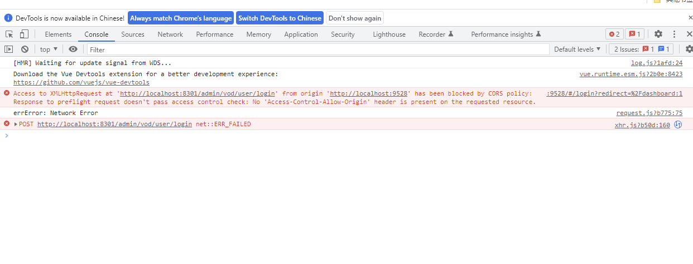

### 什么是跨域
浏览器从一个域名的网页去请求另一个域名的资源时， **协议、域名、端口** 任一不同，都是
跨域 。前后端分离开发中，需要考虑ajax跨域的问题。


### 跨域的本质
浏览器对Ajax请求的一种限制

### 报错信息


```
Access to XMLHttpRequest at 'http://localhost:8301/admin/vod/user/login' from origin 'http://localhost:9528' has been blocked 
by CORS policy: Response to preflight request doesn't pass access control check: No 'Access-Control-Allow-Origin' header is 
present on the requested resource.
```

### 解决方法
1. 在后端接口controller添加`@CrossOrigin`注解
2. 使用httpclient
3. 通过gateway网关